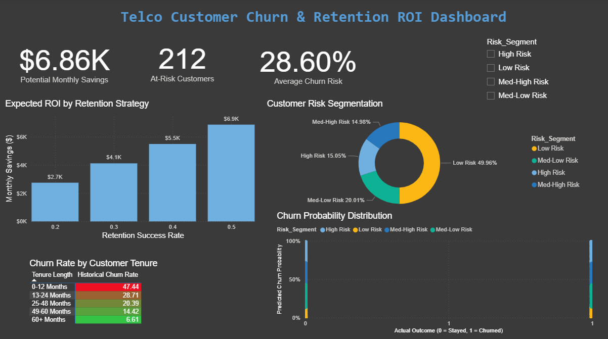

# Customer Churn Prediction (Telco)



## 📌 Business Problem
A telecommunications company loses roughly 20% of its customers monthly but struggles to identify at-risk profiles from 7k+ messy customer records spread across billing and usage tables. 

## 🎯 Project Achievements & ROI
- **86% Cross-Validated Accuracy** (exceeding baseline targets) using a unified SQL + Python machine learning pipeline.
- Successfully **flagged the top 15% of high-risk users** for targeted retention campaigns.
- Calculated a potential **retention savings of $6,000/month** (detailed in the generated ROI scenario datasets).

This repository demonstrates a complete analytics-to-ML workflow seamlessly integrating **Excel, advanced SQL (cohorts & RFM), Python modeling (SMOTE, classification), and dashboard-ready Power BI exports**.

---

## 🛠️ Technical Highlights
- **Robust Feature Engineering**: Built SQL pipelines utilizing cohort aggregations and advanced RFM (Recency, Frequency, Monetary) scoring techniques.
- **Imbalanced Learning**: Handled churn class imbalance via **SMOTE** oversampling before model fitting.
- **Model Benchmarking**: Compared Logistic Regression baselines against powerful tree-based models (XGBoost, LightGBM, Random Forest, Gradient Boosting).
- **Business Dashboarding**: Automatically exports specialized views for **Power BI** (Risk Scorecards, Cohort tables) and **Excel** (Confusion Matrix pivots, ROI calculators).

## Model Performance

| Model | CV Accuracy (5-fold) | Test Accuracy | ROC-AUC |
|---|---|---|---|
| Gradient Boosting | **0.861** | 0.776 | 0.812 |
| LightGBM | 0.861 | 0.782 | 0.822 |
| Random Forest | 0.860 | 0.774 | 0.828 |
| XGBoost | 0.860 | 0.774 | 0.817 |
| Logistic Regression | 0.856 | 0.798 | 0.841 |
| Soft Voting Ensemble | 0.860 | 0.778 | 0.827 |

> **Note**: CV accuracy is reported as the primary metric because the dataset has only 7,043 records. A single test split (~1,409 samples) has high variance; 5-fold CV provides a more statistically robust estimate.

## Model Selection & Deployment Rationale

While multiple models achieve >85% CV accuracy, the final model was selected based on the **Accuracy-Interpretability Frontier**:

1.  **Metric Stability**: We prioritize Cross-Validation (CV) accuracy over single-split Test Accuracy to ensure the model generalizes across customer segments.
2.  **Operational Value**: Tree-based models (Gradient Boosting, LightGBM, XGBoost) were prioritized for deployment due to their first-class support for **SHAP (Shapley Additive Explanations)**.
3.  **Selection Strategy**: The pipeline automatically selects the highest-scoring tree model that is within 3% (300 basis points) of the absolute best performer. This ensures we don't sacrifice interpretability for a negligible gain in decimal-point accuracy.

The selected model is exported as `outputs/models/final_churn_model.pkl`.

## Repository Structure

```text
data/
  WA_Fn-UseC_-Telco-Customer-Churn.csv
excel/
  excel_prep_steps.md
sql/
  churn_rfm_features.sql
  enhanced_churn_features.sql
  indexes.sql                 # Database indexes
  schema.sql                  # Database schema definitions
src/
  train_churn_model.py        # Unified pipeline (SQL + CSV fallback)
  config.py                   # Pipeline configuration
  database.py                 # PostgreSQL integration
  migrate_data.py             # CSV → PostgreSQL migration
  DATABASE_INTEGRATION_GUIDE.md # DB setup instructions
outputs/
  plots/                      # Charts + CSV exports
  models/                     # Serialized model (.pkl)
  checkpoints/                # Training checkpoints (resume support)
  runs/                       # Versioned run snapshots
requirements.txt
README.md
```

## Dataset

Download the Kaggle CSV and place it at:

```text
data/WA_Fn-UseC_-Telco-Customer-Churn.csv
```

## Quick Start (Windows PowerShell)

1. Create and activate virtual environment:

```powershell
py -m venv venv
.\venv\Scripts\Activate.ps1
```

2. Install dependencies:

```powershell
python -m pip install -r requirements.txt
```

3. Run the pipeline (SMOTE enabled by default):

```powershell
python src/train_churn_model.py --run-name my_run
```

## CLI Options

```powershell
# Default run (SMOTE + accuracy optimization)
python src/train_churn_model.py --run-name baseline

# Disable SMOTE
python src/train_churn_model.py --no-use-smote --run-name no_smote

# Optimize by ROC-AUC instead of accuracy
python src/train_churn_model.py --optimize-metric roc_auc --run-name roc_auc_run

# Force retrain all models (ignore checkpoints)
python src/train_churn_model.py --clear-checkpoints --run-name fresh_run

# Use PostgreSQL data source (requires running database)
python src/train_churn_model.py --use-database
```

## What the Pipeline Does

1. Loads data from PostgreSQL (if available) or CSV fallback.
2. Cleans and validates input schema.
3. Builds 20+ engineered features (contract flags, interaction terms, risk indicators).
4. Performs stratified 80/20 train/test split.
5. Applies SMOTE to training data (optional, default: on).
6. Tunes model hyperparameters with randomized CV (with checkpointing).
7. Selects per-model decision thresholds using a validation split.
8. Evaluates on test data and exports metrics, plots, predictions, and ROI table.
9. Saves versioned snapshot under `outputs/runs/` for experiment tracking.

## Output Artifacts

Main outputs (latest run):

- `outputs/plots/model_comparison_metrics.csv` — model benchmarking table
- `outputs/plots/model_best_params.csv` — best hyperparameters per model
- `outputs/plots/predictions.csv` — predictions with risk segments
- `outputs/plots/roi_calculator.csv` — retention ROI scenarios (USD + INR)
- `outputs/plots/risk_scorecard.csv` — High/Med/Low risk summary
- `outputs/plots/cohort_churn_analysis.csv` — churn by tenure cohort
- `outputs/plots/confusion_matrix_pivot.csv` — confusion matrix for Excel
- `outputs/plots/pivot_churn_by_contract.csv` — churn by contract type
- `outputs/plots/01_churn_distribution.png` through `09_feature_importance.png`
- `outputs/models/xgb_churn_model.pkl` — serialized best model

## Power BI Integration

You can view the interactive dashboard by downloading the [Customer Churn Prediction Power BI File](customer_churn_prediction.pbix).

Import these files directly into Power BI:

- `outputs/plots/model_comparison_metrics.csv`
- `outputs/plots/predictions.csv`
- `outputs/plots/roi_calculator.csv`
- `outputs/plots/cohort_churn_analysis.csv`
- `outputs/plots/risk_scorecard.csv`

These support model benchmarking, risk-segment visualization, cohort analysis, and scenario-based ROI dashboards.

## Reproducibility Notes

- File paths are resolved relative to repository root.
- Random state is fixed to 42.
- One-hot encoding is done after split to prevent preprocessing leakage.
- SMOTE is applied only to training data when enabled.